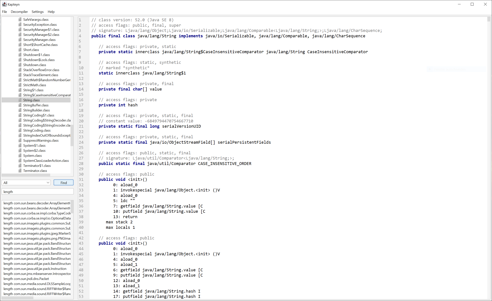

# Kapteyn-UI



## Features

Decompiler:
* Full support of the [Java 8 classfile format](https://docs.oracle.com/javase/specs/jvms/se8/html/jvms-4.html) and the [Java 8 instruction set](https://docs.oracle.com/javase/specs/jvms/se8/html/jvms-6.html) 
* Fast loading time and accurate representation of the bytecode

Application:
* **Saving** single class files and whole Jar files
* **Settings** to alter the behaviour of the decompiler
* Clean and intuitive UI with a **light and dark theme**
* **Search** feature for finding method references, field references, local variables, and constant strings

## How to build

```
git clone https://github.com/mrsalwater/Kapteyn-UI.git
cd Kapteyn-UI
./gradlew build
```

## References

* [FlatLaf](https://github.com/JFormDesigner/FlatLaf)  
    "FlatLaf is a modern open-source cross-platform Look and Feel for Java Swing desktop applications."  
    It is licensed under the [Apache-2.0](https://apache.org/licenses/LICENSE-2.0) license.

* [JSON-java](https://github.com/stleary/JSON-java)    
    "JSON is a light-weight, language independent, data interchange format."  
    It is licensed under [JSON](https://json.org/license.html) license.

---

_This software is licensed under the [MIT License](https://opensource.org/licenses/MIT)_  
_Copyright 2020 mrsalwater_